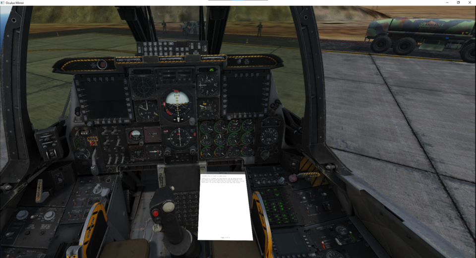
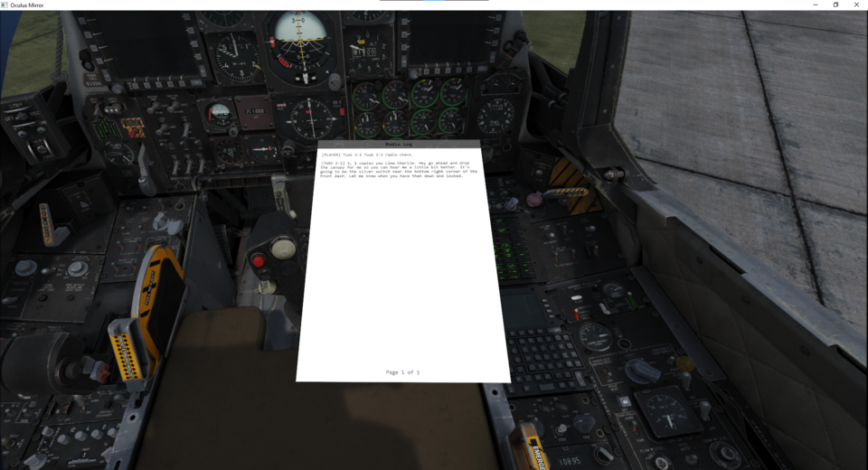
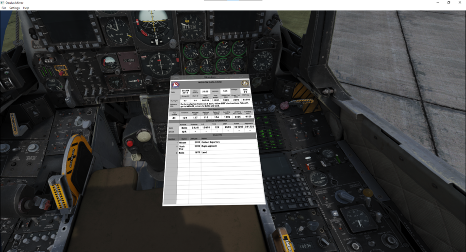
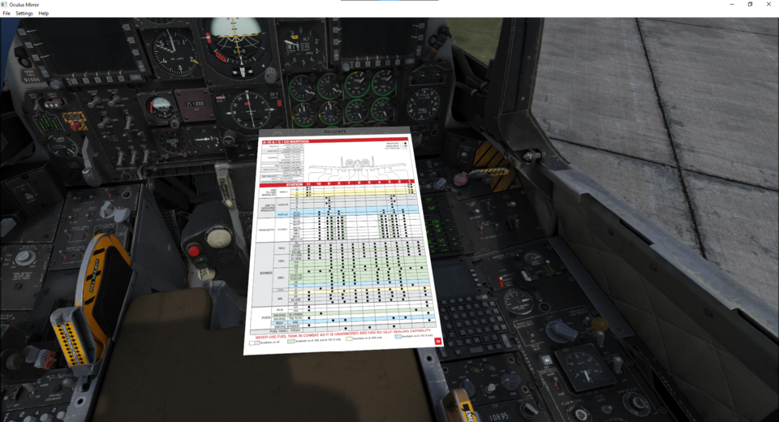

# OpenKneeboard

OpenKneeboard is an open source Kneeboard application, primarily aimed at virtual reality flight simulators, such as DCS World.

## Current Status

This is best thought of as a 'developer preview': it works for me, on my computer, but has not been significantly used by others. The settings UI and documentation are particularly lacking at present.

If you are not a C++ developer, you may want to use [VRK](https://forums.eagle.ru/topic/211308-vrk-a-virtual-reality-enabled-kneeboard-with-touch-and-ink-support) instead.

## WARNING: Anti-Cheat

While OpenKneeboard is not a cheat, it does hook into the games rendering pipeline, which over-eager anti-cheat systems may consider suspicious. While this is similar to how other overlays work (e.g. Steam and Discord), it is possible that using OpenKneeboard may lead to an anti-cheat ban.

Note that OpenKneeboard has **NO WARRANTY**; see [the LICENSE file](LICENSE) and [full text of the GPLv2](gpl-2.0.txt) for details.

## Getting Help

I make this for my own use, and I share this in the hope others find it useful; I'm not able to commit to support, bug fixes, or feature development.

Support may be available from the community via:

- [GitHub Discussions](https://github.com/fredemmott/OpenKneeboard/discussions)
- [Discord](https://discord.gg/CWrvKfuff3)

I am not able to respond to 1:1 requests for help via any means, including GitHub, Discord, Twitter, Reddit, or email.

## Requirements

- Up-to-date 64-bit Windows 10
- A graphics card that supports Direct3D 11

Windows 11 is untested, and I am unable to investigate any issues reported with OpenKneeboard on Windows 11.

## Features

### DirectInput Control

Bind any of your device buttons (even if you have 128) to show/hide the kneeboard, previous tab, next tab, previous page, or next page.

### Attach to running games

Fits with your flow; no need to launch the games via OpenKneeboard, or to start OpenKneeboard first.

### VR? Non-VR? Either works.

### VR Zoom

Don't cloud your cockpit: goes out of the way when you're not looking at it.

### DCS Radio Log

A log of all radio messages that are shown by DCS World as text in the top left corner - there is no transcription. This is very useful for single player campaigns.

Screenshot from [Baltic Dragon's excellent Iron Flag campaign for the A-10C II](https://www.baltic-dragon.net/copy-of-a-10-tew-3-0).

### Categorized DCS Kneeboard

Quickly jump between sections:

#### Mission Tab

Screenshot from [Baltic Dragon's excellent Iron Flag campaign for the A-10C II](https://www.baltic-dragon.net/copy-of-a-10-tew-3-0).

#### Aircraft Tab

Screenshot from [Goldwolf's DCS Reference Guide](https://www.digitalcombatsimulator.com/en/files/3318384/)

#### Theater Tab

Field info etc

I believe these are currently only provided for the Caucasus and NTTR theaters.

### Not *just* for DCS

You can also add any other folder of images as another tab; this works great in DCS, or in other games.

## Supported Games

- Non-VR: DirectX 11
- OpenVR: any
- Oculus: DirectX 11, DirectX 12.

I hope to expand this list in the future, especially for OpenXR.

OpenKneeboard has been primarily tested with DCS: World via the Oculus SDK, using DirectX 11.

## Thanks

- BeamRider for the [VRK](https://forums.eagle.ru/topic/211308-vrk-a-virtual-reality-enabled-kneeboard-with-touch-and-ink-support) project, for showing how useful an in-VR kneeboard is, and clear inspiration for OpenKneeboard.
- [Benjamin Höglinger-Stelzer a.k.a. Nefarius](https://nefarius.at/) for the [Injector](https://github.com/nefarius/Injector) utility, which has been extremely useful for development.
- Nefarius and the other members of the ViGEm Discord for lots of advice/feedback/information on DirectX, Detours, and other aspects of Windows development.
- [AMD GPUOpen's OCAT project](https://gpuopen.com/ocat/) for demonstrating overlay rendering in applications using the Oculus SDK.

## Developer Information

- This project is written in C++20
- It is built with CMake
- It is primarily developed with Visual Studio Code, using the compilers from Visual Studio 2022. Only the 'Build Tools for Visual Studio 2022' package is required, but 'Community Edition' or better also work fine.
- The UI is built with wxWidgets

For details on some internals, see [docs/internals/](docs/internals/).

## License

OpenKneeboard is licensed under the GNU General Public License, version 2.

This project uses several third-party libraries, which are used and distributed under their own license terms.
