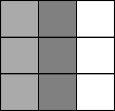

# Frequently Asked Questions
{: .no_toc }

## Table of Contents
{: .no_toc, .text-delta }

1. TOC
{:toc}

Also see:
- The [feature requests FAQ](feature-requests.md)
- The [third-party developer FAQ](third-party-developers.md)

## When should I start OpenKneeboard?

For the most part, it doesn't matter; if you find that OpenKneeboard only works reliably if you start things in a certain order, please [report a bug](https://go.openkneeboard.com/issues).

The one exception is if there is an update for OpenKneeboard: installing or updating OpenKneeboard might need you to restart any open games or OpenXR applications, so it's better to either start OpenKneeboard first in case there's an update, or leave installing updates until after you've finished the game for the day; you can install the update later by clicking 'Check for Updates' in the Help section.

## How do I use the mouse in-game?

Mice are not supported in-game; the toolbar is shown as it can be used with graphics tablets, like those made by Wacom or Huion.

Mouse support is unlikely to be added soon as it requires interfering with how the game accesses the mouse and other input devices. This is likely to cause issues with:

- anti-cheat
- the mouse and other input devices becoming unusable in the game itself

Mouse support is not planned; any updates will be on [the GitHub issue](https://github.com/OpenKneeboard/OpenKneeboard/issues/374). If there are no updates there, there is no news or ETA.

## How do I stop the administrator or UAC warnings showing up every time?

- Don't run OpenKneeboard as administrator
- Turn UAC on and reboot

There is no other way, and one won't be added - don't ask.

Prior to these warnings being added, administrator and UAC issues were by far the most common cause of support requests.

### When I do that, everything else prompts me all the time.

Stop running everything else as administrator.

## How do I use my iPad, Microsoft Surface, other tablet computer, or phone with OpenKneeboard?

OpenKneeboard only supports graphics tablets (sometimes called 'artists tablets') such as those made by Wacom or Huion, not tablet computers or phones.

## How do I use my Xbox, Xbox clone, or other XInput controller with OpenKneeboard?

Unfortunately, Microsoft restricted Windows so that these kinds of controllers are only usable by the active Window, so they can't be used by OpenKneeboard when the game is active.

## How do I change the focal distance in VR?

As of February 2023, every consumer headset has a single focal distance for everything, which is usually between 1.3m and 2m. On some headsets this is fixed, and on other headsets, it can be adjusted by physical knobs on the headset. **No currently available headset is physically capable of adjusting focal distance for only part of what is shown**.

The discomfort happens when your eyes move between items that appear to be at different distances, but have the same focal distance; it is a physical limitation of current headsets.

Over time, most people will get used to this and it will naturally become more comfortable; you can also make things more comfortable by adjusting the rendered distance to be closer to other items in the environment, like the cockpit controls.

## How do I make OpenKneeboard start minimized?

Launch OpenKneeboard with a `--minimized` parameter; for example, by editing the shortcut:

## How do I remove the header or footer ('borders')?

The header and footer can be disabled in Advanced Settings.

## How do I quickly adjust the VR position?

If you want things in the same place every time but they're inconsistent, recenter; **it works best to bind the same button combination for recentering OpenKneeboard and in-game**.

If you want to quickly switch between intentionally different positions (for example, if you use OpenKneeboard with multiple games or multiple aircraft), enable profiles in advanced settings, and create a different profile for each position that you want.

## How do I make landscape documents larger, like Chuck's Guides?

Open Settings -> VR -> Size, then increase "kneeboard width limit"; you may want to set it to a very high value (e.g. 10 meters), in which case the size will still be limited by the vertical height and aspect ratio.

The downside of increasing this limit is that the kneeboard is likely to interfere with the cockpit and controls.

## How do I get the best visual quality or the most readable text?

If you have a non-image source (for example, a Word document, spreadsheet, or so on), export it directly as PDF, or use 'Print to PDF'; this will get the best quality. If you only have an image, do not convert it to PDF - this will lower the quality.

If you include pre-rendered text, disable sub-pixel anti-aliasing: sub-pixel antialiasing will look better on your monitor, but will look worse in headsets. Even if the headset subpixel layout matches, when rendered in 3D in VR and projected for lense distortion, the image pixel grid will *never* line up with the headset pixels.

For images, if the kneeboard - including OpenKneeboard's header and footer - is larger than 2048x2048 pixels or (when non-VR is active) the configured maximum on-screen size, it will be resized to fit, which will lower the quality.

To give space for header, footer, bookmarks bar etc, aim for any images to have heights and widths that are less than 1600px for VR, or 100px less than the configured maximum size for non-VR.

These guidelines are for new images; in general, resizing existing images will lower the quality compared to letting OpenKneeboard resize the image as needed. If you do choose to resize images, you will usually get the most readable text and clearest lines if you divide the number of pixels by a whole number. For example, if you have a 3000x3000px image, a half-sized version (1500x1500px) will usually be more readable than resizing to 1900x1900px, despite 1900x1900 being higher resolution.

This is because when you divide the size by a whole number, each original pixel is entirely within (part of) one pixel in the resized image. On the other hand, if you for example resize a 4x4 image to 3x3, the original second pixel will now be part of both the first and second pixels in the resized image, which will make text and lines blurry:

Original image:

Resized to 2x2 (half size):

While the contrast is reduced because of merging with the pixel on the left, the line still has a solid border and is 1px wide.

Resized to 3x3 (75%):

The vertical line now straddles two pixels, with a gradient between them; this results in blurry text and lines.

## OpenKneeboard moves slightly ('floats' or 'shudders') compared to the in-game world. What's up?

This generally means that your game is running at a lower framerate than your headset, and is unavoidable: OpenKneeboard provides a fixed real-world location, and it is up to the runtime and headset to render these. As OpenKneeboard is simple 2D content with a known 3D position, the headset/runtime can do a better job of adjusting OpenKneeboard's content for real-world movement than it can the game itself.

One way to think about it is that runtimes/headsets are doing something equivalent to 100% perfect reprojection for OpenKneeboard's content, but not for the game - this is because for 2D content, it's just projection, not *re*-projection.

This effect can be exaggerated by tools that change how your real-world movement affects in-game movement, especially if reprojection/SW/ASW or similar techniques are disabled.

## I use another OpenXR tool (API layer); what should the order be?

If the other tool provides instructions for OpenKneeboard, follow those instructions. *If the other tool does not provide instructions for OpenKneeboard* and you want the other tool to affect OpenKneeboard or you encounter issues, then install and run [OpenXR API Layers GUI](https://github.com/fredemmott/OpenXR-API-Layers-GUI) and position OpenKneeboard *above* the other layers.

If you encounter problems, you can try putting the layer above OpenKneeboard; if this solves problems, it is most likely a bug in the other layer, especially in the handling of poses/spaces. It is expected that it may introduce other problems; in particular, OpenKneeboard is likely to be locked to the real world (i.e. your room), rather than the game world (e.g. your in-game rendered cockpit), unlike the rest of the game.

*I do not provide support for third-party tools*. While OpenKneeboard is not bug-free, *every* time I have investigated an ordering requirement issue, it has turned out to be bug in the other layer; while I no longer investigate unknown interactions between layers, I am happy to investigate issues where there is evidence that the issue is in OpenKneeboard. "It is fixed by changing the layer order or disabling OpenKneeboard" is not evidence of a bug in OpenKneeboard if other layers are present.

If you are a developer of a layer that manipulates poses or spaces, there is a [separate developer FAQ](third-party-developers.md#api-layers-that-manipulate-poses).

## I use a tool that changes how my real-world movement affects in-game movement; how do I use it with OpenKneeboard?

If the other tool provides instructions for OpenKneeboard, follow those instructions. *If the other tool does not provide instructions for OpenKneeboard*:

1. install and run [OpenXR API Layers GUI](https://github.com/fredemmott/OpenXR-API-Layers-GUI)
2. put OpenKneeboard *above* the other tool

If the other tool is below OpenKneeboard, OpenKneeboard will be anchored to your in-game world - for example, it will be in a constant position relative to your in-game plane/car cockpit. If this is not the case, contact the developers of your tool for assistance.

If the other tool is above OpenKneeboard, OpenKneeboard will be anchored to something in the real-world - generally your room, but specific behavior depends on your setup and tracking system. It will *not* be anchored to the in-game world if using one of these tools. This is almost never what you want - it will be inconsistent with the rest of the game.

If you encounter problems, you can try putting the layer above OpenKneeboard; if this solves issues, it is most likely a bug in the other layer, especially if this is required for the game or its' VR mode to function at all. It is likely that this ordering will mean that OpenKneeboard is not displayed in the correct position - this can only be fixed by solving whatever issue leads to the ordering requirement, which is almost always a bug in the other layer.

*I do not provide support for or investigate issues with third-party tools*. While OpenKneeboard is not bug-free, *every* time I have investigated an ordering requirement issue, it has turned out to be bug in the other layer; while I no longer investigate unknown interactions between layers, I am happy to investigate issues where there is evidence that the issue is in OpenKneeboard. "It is fixed by changing the layer order or disabling OpenKneeboard" is not evidence of a bug in OpenKneeboard if other layers are present.

As a user, your best way forward is to look for help from the other tool, and consider pointing the developer towards [the developer FAQ for this](third-party-developers.md#api-layers-that-manipulate-poses).

## What settings do you recommend?

I choose what the defaults are, so, the defaults ;)

## Where are OpenKneeboard's settings saved?

On v1.8 and below, OpenKneeboard's settings are in the 'OpenKneeboard' subfolder of your 'Saved Games' folder; this is *usually* `C:\Users\YOUR_USERNAME_HERE\Saved Games`, but it is possible that you have moved it.

On v1.9 and above, OpenKneeboard's settings are in `%LOCALAPPDATA%\OpenKneeboard\Settings`.

*OpenKneeboard's settings files are for its' own use only*; no help is available for modifying them, and you should not create or use any tools that modify them. OpenKneeboard makes no attempt to handle settings files that have been altered by anything other than OpenKneeboard itself. Any issues will be assumed to be your fault, and you are on your own for fixing them.

## Why do I need to add something that isn't a game to the games list?

You don't; anything or anyone telling you that you need to is giving you bad advice.

Adding things that aren't games to the games list has *never* been necessary or beneficial, and it has often caused performance problems.

## Why won't OpenKneeboard let me add some app to the games list?

Because it's not a game - [you don't need to add it, and adding it would be harmful](#why-do-i-need-to-add-something-that-isnt-a-game-to-the-games-list).

## How do I remove OpenKneeboard?

Uninstall it from add/remove programs. **DO NOT USE THIRD-PARTY UNINSTALLER TOOLS**.

If you want a more thorough removal - including permanently deleting your settings - use [the Fresh Start tool](https://github.com/OpenKneeboard/Fresh-Start). If you're not certain, use add/remove programs instead.

## My framerate improves when I hide OpenKneeboard when the app is still running; what's up?

When OpenKneeboard is hidden, it keeps doing 99.9% of what it does when it's visible; the biggest change when you hide OpenKnebeoard is that your VR runtime no longer needs to combine the 3D and 2D content.

If hiding OpenKneeboard while it's still running has a significant effect on your framerate, this indicates the performance limitation is your VR runtimes' compositor; this **CAN NOT** be improved by OpenKneeboard - if you need improvements, contact your runtime vendor/headset manufacturer.

## I have another performance problem

OpenKneeboard is highly efficient; if you have already tuned your system to the limit without OpenKneeboard, even the slightest bit of extra load will make any small usage have an outsized effect.

If you believe this is not the trace, and you have *NO* drops without OpenKneeboard (but with the same overlays/content open), reach out on Discord or GitHub issues with [a detailed OpenXR trace](../troubleshooting/logs-and-traces.md#detailed-openxr-traces) showing the problem, along with logs/charts from a tool such as HWMONITOR-PRO showing that you are not unrelatedly hitting thermal/power limits.