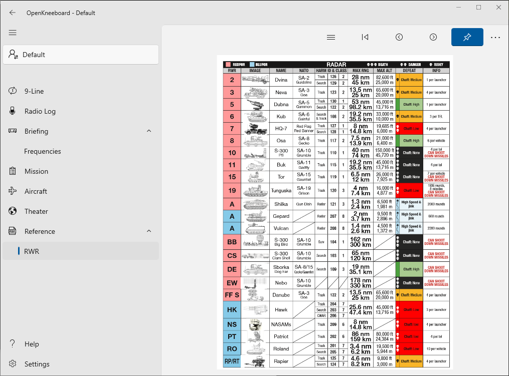
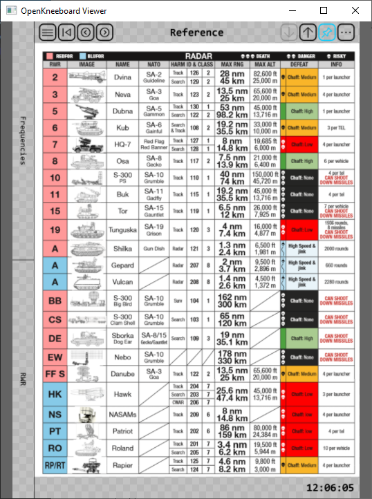

# Bookmarks

**This feature will be available in v1.4**

Bookmarks are a shortcut to a specific page within a tab; this can be useful for jumping to a specific part of the mission briefing, or a reference guide.

Add a bookmark by clicking on the 'pin' icon in the top right of the toolbar:

Bookmarks then appear in the left navigation of the OpenKneeboard app, and can be renamed by right-clicking on them.

If you are using OpenKneeboard [with a graphics tablet](./graphics-tablets.md), you can also add, remove, or jump to bookmarks in game:

## Current limitations

- Bookmarks are not saved between restarts or profile switches; any updates will be on [the GitHub issue](https://github.com/OpenKneeboard/OpenKneeboard/issues/253)
- It is only possible to rename bookmarks in the main OpenKneeboard app, not in-game