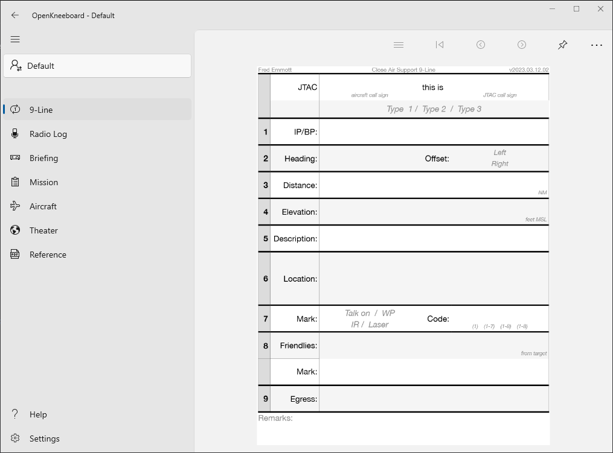

# Endless Notebook

An endless notebook tab uses a template file (usually an image or PDF), and whenever you draw on it or take notes, a new page is added, showing the same image. If the file contains multiple pages (e.g. like most PDF files), the first page of the file will be used as the template for all pages in the endless notebook.

This is commonly used with:
- a blank image or an image of lined/dot/graph paper, as a general purpose notebook or sketch pad
- a form, like a CAS 9-line template

Add an Endless Notebook tab with OpenKneeboard Settings -> Tabs -> Add a Tab.

Endless Notebook tabs are only useful when using OpenKneeboard [with a graphics tablet](./graphics-tablets.md).

