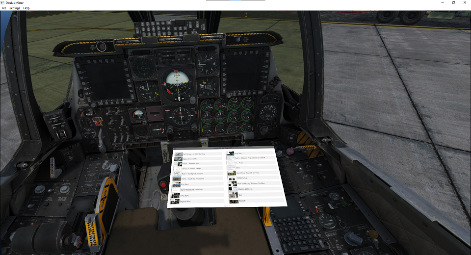

# PDF Links and TOC

If you are [using a graphics tablet with OpenKneeboard](./graphics-tablets.md), OpenKneeboard has enhanced support for PDF files, including:

- the ability to click on links within PDF files
- suppport for the table of contents ('PDF bookmarks'), if the creator of the PDF has included them in the PDF

To access the table of contents, click the navigation button in the top left of OpenKneeboard's toolbar:

