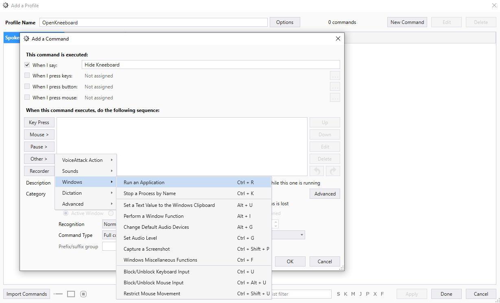
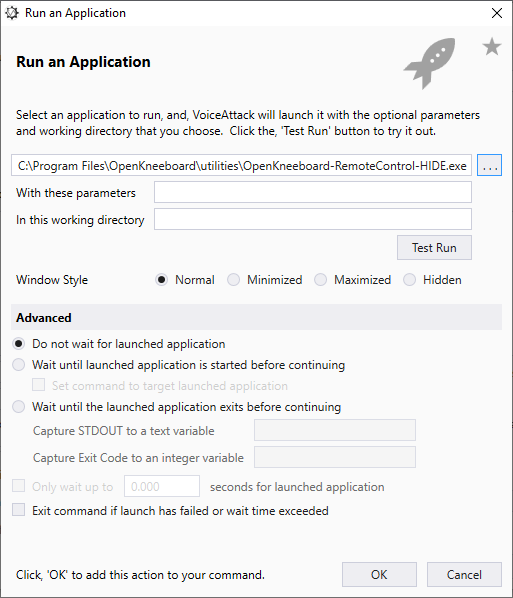
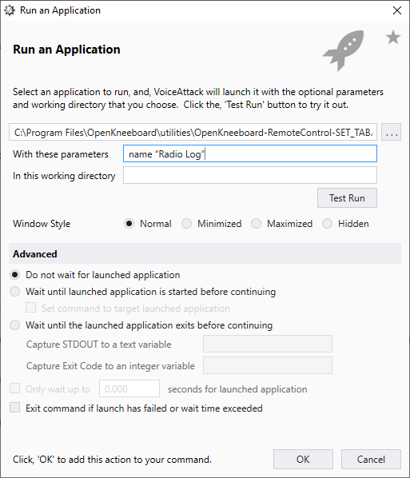

# VoiceAttack

OpenKneeboard includes [remote control executables](./remote-controls.md) in `C:\Program Files\OpenKneeboard\utilities`, which can be used with VoiceAttack:

## Configuration

Select "When this command executes, do the following sequence:" -> 'Other' -> 'Windows' -> 'Run an Application':

Then, select the remote control you want from `C:\Program Files\OpenKneeboard\utilities`:

For remote controls that take parameters, put them in the 'With these parameters' box - for example:

> name "Radio Log"

... or ...

> id "{8e882d1e-de80-4b35-9388-f41a01d94a3d}"

This example ID will not be valid on your installation.

