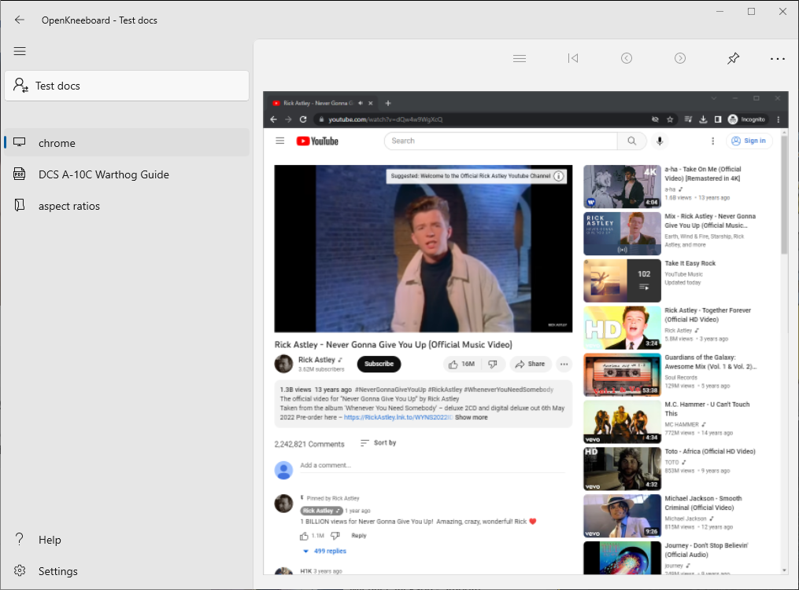

# Window Capture

Window Capture tabs embed a window within OpenKneeboard; this can be used to bring a window into VR:

If you have [a graphics tablet](./graphics-tablets.md), you can use that to interact with the captured window while in game.

If this is all you use OpenKneeboard for, you might want to [hide OpenKneeboard's header and footer](../faq/index.md#how-do-i-remove-the-header-or-footer-borders).

If you encounter problems, check [the troubleshooting guide](../troubleshooting/window-capture-compatibility.md); if there steps there don't resolve your problems, check out [Getting Help](../getting-help.md).