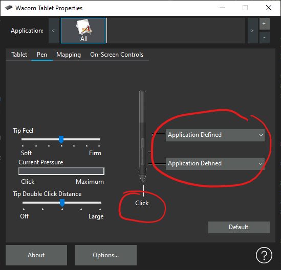
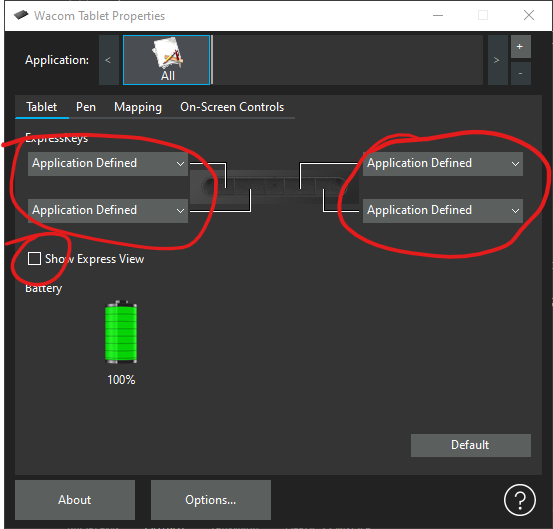
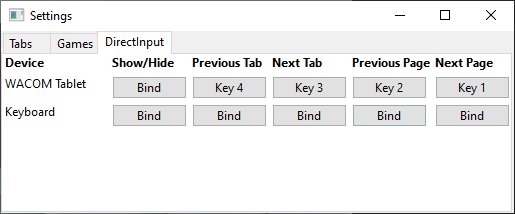

# Using Wacom Tablets with OpenKneeboard

Wacom tablets can either be used with Wacom's drivers, or [with OpenTabletDriver](https://go.openkneeboard.com/otd-ipc).

OpenTabletDriver is *STRONGLY* recommended; Wacom's driver is only still supported by OpenKneeboard in case you need it for other software.

**If you use Wacom's drivers, you must use driver v6.4.5 or earlier**, as essential features have been removed in v6.4.6 of Wacom's driver.

## Using OpenTabletDriver

1. Uninstall your manufacturer's tablet drivers
2. [Install OpenTabletDriver and OTD-IPC](https://go.openkneeboard.com/otd-ipc)
3. Enable OpenTabletDriver in OpenKneeboard's input settings

## Using Wacom's drivers

OpenTabletDriver is *STRONGLY* recommended; Wacom's driver is only still supported by OpenKneeboard in case you need it for other software.

If you choose to use Wacom's drivers, **no help is available** for tablet issues when using OpenKneeboard.

To use Wacom's drivers, You need to enable the tablet by:

1. Open OpenKneeboard's settings page (bottom left)
2. Go to the input settings page
3. Set WinTab mode to 'standard'

For earlier versions, the tablet is always enabled.

It's easiest to set all of these settings to 'All applications'; otherwise (for example, if you use your
drawing tablet for drawing :p) you'll need to apply these settings both to the OpenKneeboard app, and to
every game you want to use the tablet with. For example, you may need to create a Wacom profile for both
OpenKneeboard and DCS World.

To use the pen for drawing or UIs (e.g. PDF table of contents), you need the
following settings:

If an on-pen button is being held while drawing, the pen will act as an eraser.

If you also want to use the on-tablet 'Express Keys' to change page/tabs, you'll
also need these settings:

You can then assign the buttons to actions in Edit -> Settings in the app:

