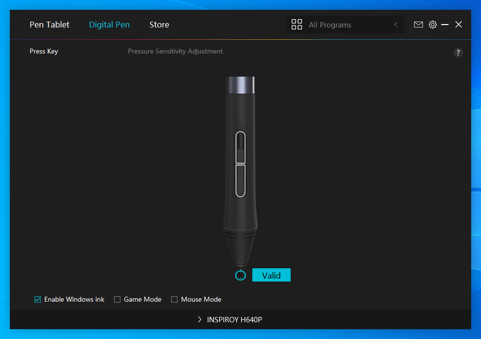
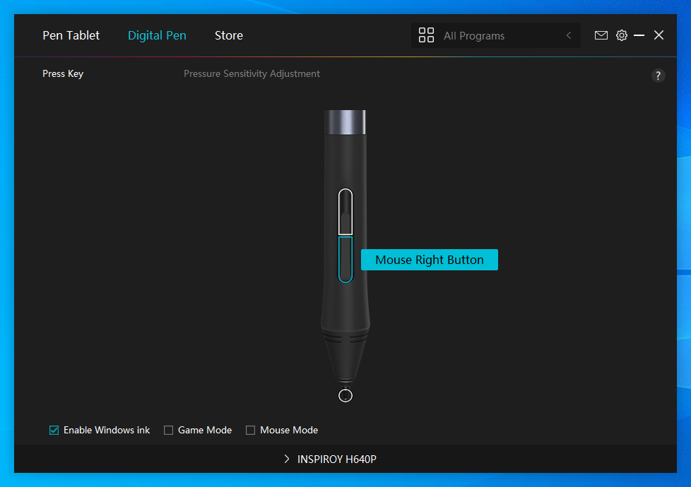
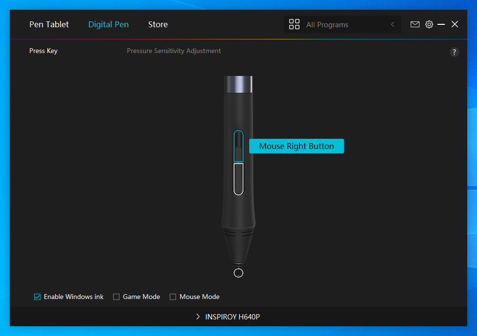
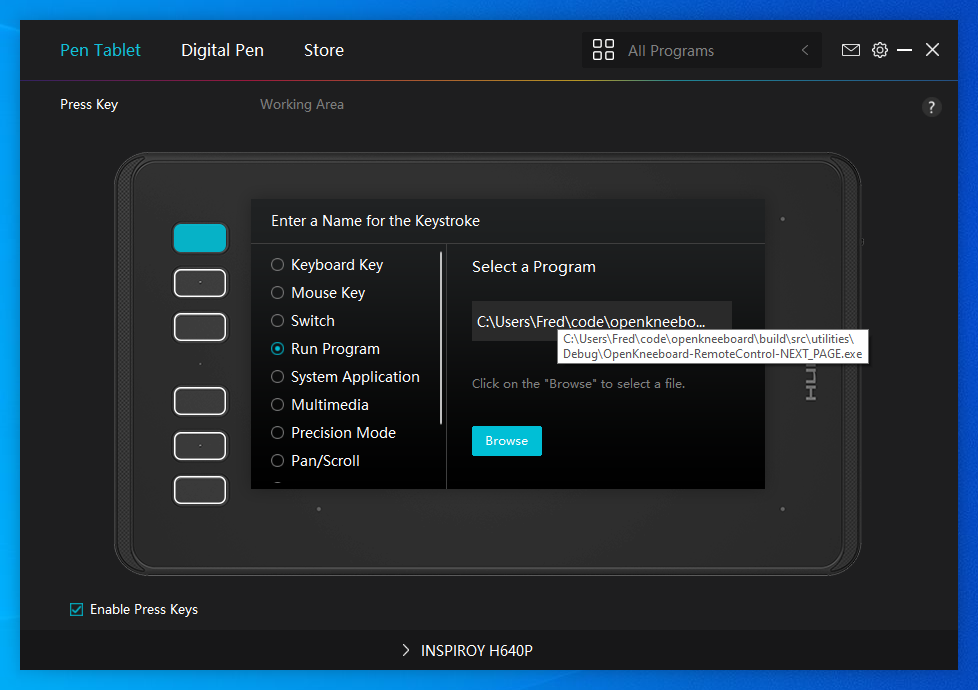

# Using Huion Tablets with OpenKneeboard

It's easiest to set all of these settings for 'All Programs'; otherwise (for example, if you use your drawing tablet for drawing :p) you'll need to apply these settings both to the OpenKneeboard app, and to every game you want to use the tablet with. For example, you may need to create a Wacom profile for both OpenKneeboard and DCS World.

To use the pen for drawing or UIs (e.g. PDF table of contents), you need to set the tip to 'Valid', and any other pen buttons to 'Mouse Right Button':

If an on-pen button is being held while drawing, the pen will act as an eraser.

If you also want to use the on-tablet 'Press Keys' to change page/tabs, you'll need to download the `OpenKneeboard-RelWithDebInfo-RemoteControl` zip from [the latest release](https://github.com/OpenKneeboard/OpenKneeboard/releases/latest), and extract it somewhere to keep. This contains several remote control executables:

To use these, open the Huion settings app, and set the press keys to 'run program', and browse to the downloaded executable you want. For example, if you want a press key to move to the next kneeboard page, select 'Run Program', then browse to and select `OpenKneeboard-RemoteControl-NEXT_PAGE.exe`:

While Huion tablets appear in OpenKneeboard's settings, the buttons can not be bound there unless a future version of Huion's driver supports the ExpressKeys API.

It is also not possible to use Huion's keypress emulation with OpenKneeboard, as Huion's keypress emulation is not compatible with DirectInput.
