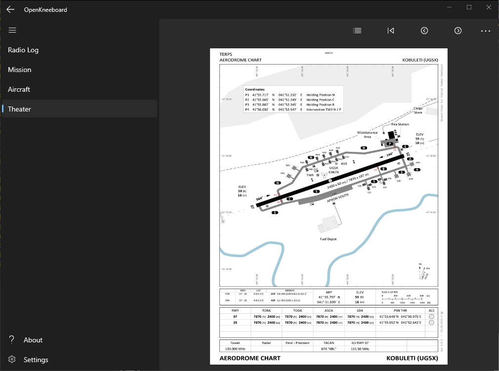
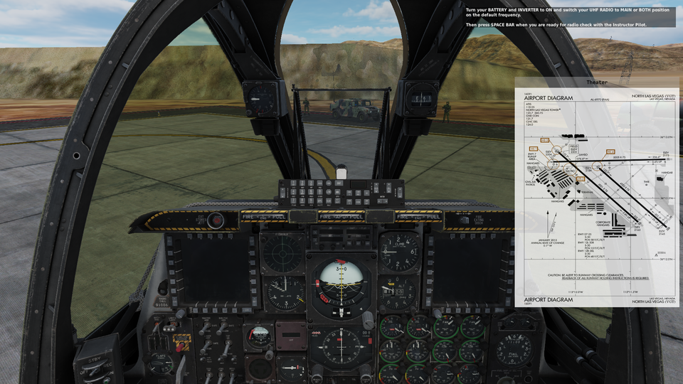
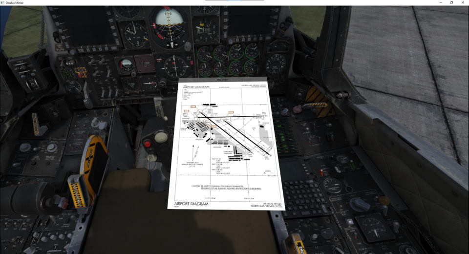

OpenKneeboard is a way to show reference information and take notes in games - especially flight simulators - including in VR. 

OpenKneeboard can be controlled via joystick/HOTAS bindings, or a graphics tablet ('artists tablet') such as those made by Wacom or Huion; phones and tablet computers like iPads or Microsoft Surface tablets are **not** compatible. Mice are not supported in-game.

## Getting Started

Note that OpenKneeboard has **NO WARRANTY**, and [anti-cheat software could theoretically have issues with it](#warning-anti-cheat)

1. Download [the latest release](https://github.com/OpenKneeboard/OpenKneeboard/releases/latest)
2. Install it; the installer will offer to launch OpenKneeboard when finished.
3. Open settings
4. Add games to the 'Games' tab if they were not automatically added; this is needed for tablet, Oculus, and non-VR support
5. Configure your bindings; if you're playing in VR, **you almost certainly want to bind 'recenter'** to the same buttons you use for the game.

## WARNING: Anti-Cheat ##

While OpenKneeboard is not a cheat, it does hook into the games rendering and input pipelines, which over-eager anti-cheat systems may consider ban-worthy. While this is similar to how other overlays work (e.g. Steam and Discord), it is possible that using OpenKneeboard may lead to an anti-cheat ban.

As of March 19th, 2024, the developers have not received any reports of any users receiving any bans in any games, but this remains a theoretical possibility in the future.

Note that OpenKneeboard has **NO WARRANTY**; see [the LICENSE file](https://raw.githubusercontent.com/OpenKneeboard/OpenKneeboard/master/LICENSE) and [full text of the GPLv2](https://raw.githubusercontent.com/OpenKneeboard/OpenKneeboard/master/gpl-2.0.txt) for details.

## Screenshots

