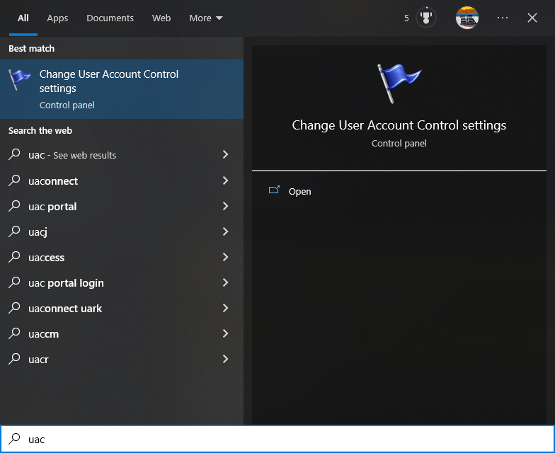

# Running Elevated/As Administrator

{: .no_toc }

OpenKneeboard will not fully work as administrator; this includes [known crash-causing bugs that can only be fixed by Microsoft](https://github.com/microsoft/microsoft-ui-xaml/issues/7690).

**This is not specific to OpenKneeboard** - on modern Windows, running any application as administrator without a specific need is more likely to cause problems than fix them.

The only way to resolve these issues is *not* to run OpenKneeboard as administrator. **If OpenKneeboard says `[Administrator]` but you are not intentionally running *anything* as administrator**, check out the [User Account Control](#user-account-control) section.

1. TOC
{:toc}

## Shortcuts

If you are launching OpenKneeboard through a shortcut, make sure that "Run this progam as an administrator" is **not** checked in the shortcut's compatibility settings:

## Other Launchers

## User Account Control

Open the start menu and find 'User Account Control' ('UAC'):

Set the slider on the left to **anything except the bottom option** ('never notify'):

The "never notify" option is misleadingly labelled and has a much larger effect than it sounds: Windows will not just stop prompting you, it will automatically run more things as Administrator.

If you have no preference or are unsure, set it to the default option with the bold tick marks:

